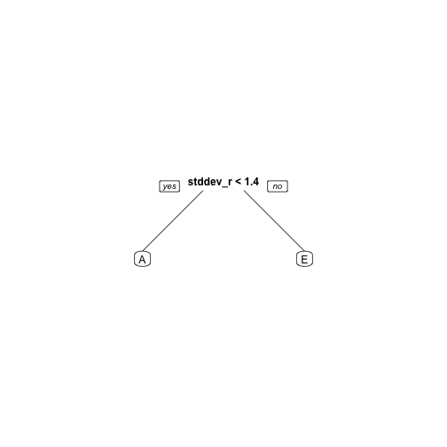

  
## Background
Using devices such as Jawbone Up, Nike FuelBand, and Fitbit it is now possible to collect a large amount of data about personal activity relatively inexpensively. These type of devices are part of the quantified self movement – a group of enthusiasts who take measurements about themselves regularly to improve their health, to find patterns in their behavior, or because they are tech geeks. One thing that people regularly do is quantify how much of a particular activity they do, but they rarely quantify how well they do it. In this project, your goal will be to use data from accelerometers on the belt, forearm, arm, and dumbell of 6 participants. They were asked to perform barbell lifts correctly and incorrectly in 5 different ways. More information is available from the website here: http://groupware.les.inf.puc-rio.br/har (see the section on the Weight Lifting Exercise Dataset). 
The data for this project come from this source: http://groupware.les.inf.puc-rio.br/har.


```r
# The goal of your project is to predict the manner in which they did the exercise. This is the "classe" variable in the
# training set. You may use any of the other variables to predict with. You should create a report describing how you 
# built your model, how you used cross validation, what you think the expected out of sample error is, and why you made 
# the choices you did. You will also use your prediction model to predict 20 different test cases. 

# I built the model for predition of exercise class using a 10-fold cross validation with a decision tree being the 
# underlying model. I initially split the trained the model on a decision tree to determine the which variables would be 
# useful for prediction. It was only splitting on the X variable so I had to disregard this feature in particular
# because it is irrelevant to the problem. Ultimatly in evaluating the cross validated initial tree the first and most
# important split was on roll_belt's standard deviation and since roll belt was not NA in either dataset. Continued
# down this same line of thought and used total_accel_belt and pitch_belt features as well

# always set seed to make research reproducible
set.seed(1000)

# Load training set
train <- read.csv("pml-training.csv")
# Load testing set
test <- read.csv("pml-testing.csv")

# inspect dataset
# str(train)
# str(test)

# summary(train)
# use simple decision tree to pick out important variables
library(rpart)
# Cross-validation
# Load libraries for cross-validation
library(caret)
library(MASS)
library(e1071)

# Number of folds
tr.control = trainControl(method = "cv", number = 10)

# cp values
cp.grid = expand.grid( .cp = 0.2)

# cross validation
exercise_cv_cart = train(classe ~ .-X, data = train, method = "rpart", metric = "Accuracy", trControl = tr.control, tuneGrid = cp.grid)
# $ Accuracy  : num 0.993 probably over fit
# Extract tree
best.tree = exercise_cv_cart$finalModel
library(rpart.plot)
# extract important features using the tree
prp(best.tree)
```

 

```r
best.tree$variable.importance[1:10]
```

    stddev_roll_belt        var_roll_belt var_total_accel_belt 
            47.46829             47.46829             41.05366 
amplitude_pitch_belt        avg_roll_belt  amplitude_roll_belt 
            39.12927             26.94146             25.65854 
                <NA>                 <NA>                 <NA> 
                  NA                   NA                   NA 
                <NA> 
                  NA 

```r
# cross validation - rpart
exercise_cart = rpart(classe ~roll_belt+total_accel_belt+pitch_belt, data = train, method = "class", xval = 10)
prp(exercise_cart)
```

 

```r
# error rate
printcp(exercise_cart)
```


Classification tree:
rpart(formula = classe ~ roll_belt + total_accel_belt + pitch_belt, 
    data = train, method = "class", xval = 10)

Variables actually used in tree construction:
[1] pitch_belt roll_belt 

Root node error: 14042/19622 = 0.71563

n= 19622 

        CP nsplit rel error  xerror      xstd
1 0.115155      0   1.00000 1.00000 0.0045002
2 0.035821      1   0.88485 0.88485 0.0048075
3 0.025808      2   0.84902 0.84924 0.0048707
4 0.016059      9   0.65760 0.65810 0.0049794
5 0.014101     11   0.62548 0.62641 0.0049611
6 0.013958     12   0.61138 0.61580 0.0049526
7 0.013246     13   0.59742 0.59913 0.0049369
8 0.013104     15   0.57093 0.57741 0.0049121
9 0.010000     16   0.55783 0.55911 0.0048873

```r
# 0.71563

predictTest <- predict(exercise_cart, type = "class", newdata = test)
answers <- as.character(predictTest)
answers 
```

 [1] "A" "A" "B" "D" "A" "E" "A" "A" "A" "A" "A" "A" "B" "A" "D" "A" "A"
[18] "A" "A" "B"

```r
# cross validation - randomForest
exercise_rf_cv = train(classe ~roll_belt+total_accel_belt+pitch_belt, data = train, method = "rf", metric = "Accuracy", trControl = tr.control)
```

note: only 2 unique complexity parameters in default grid. Truncating the grid to 2 .

```r
# error rate
print(exercise_rf)
```

```
## Error in print(exercise_rf): object 'exercise_rf' not found
```

```r
# 0.2655218

predictTest <- predict(exercise_cart, type = "raw", newdata = test)
```

```
## Error in match.arg(type): 'arg' should be one of "vector", "prob", "class", "matrix"
```

```r
answers <- as.character(predictTest)
answers 
```

 [1] "A" "A" "B" "D" "A" "E" "A" "A" "A" "A" "A" "A" "B" "A" "D" "A" "A" "A" "A" "B"

```r
# pml_write_files = function(x){
#   n = length(x)
#   for(i in 1:n){
#     filename = paste0("problem_id_",i,".txt")
#     write.table(x[i],file=filename,quote=FALSE,row.names=FALSE,col.names=FALSE)
#   }
# }
# 
# pml_write_files(answers)
```
